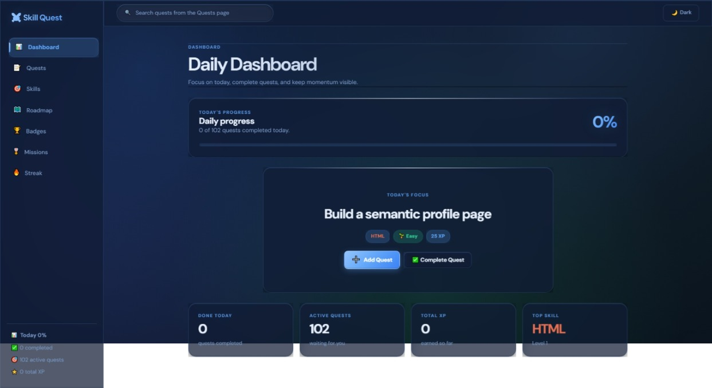

# Skill Quest Dashboard

## Preview




Skill Quest Dashboard is a vanilla HTML/CSS/JavaScript learning dashboard served by a Node.js + Express backend. The UI keeps the existing soft glass theme while app data is stored in temporary in-memory backend state.

## Run

```bash
npm install
npm run dev
```

Open:

```text
http://localhost:3000
```

Production-style start:

```bash
npm start
```

## Structure

```text
Skill Quest Dashboard
├── public
│   ├── index.html
│   ├── css
│   │   └── style.css
│   ├── js
│   │   └── app.js
│   └── files
├── server.js
├── package.json
├── package-lock.json (generated after npm install)
├── .env
├── .gitignore
└── README.md
```

## Storage

The backend uses in-memory storage. Data persists across browser refreshes while the server is running, but resets when the server restarts or when `POST /api/reset` is called.

LocalStorage is used only for local UI preferences such as the theme.

## API Response Format

Successful mutation routes return the full updated app state:

```json
{
  "skills": [],
  "tasks": [],
  "missions": [],
  "badges": [],
  "roadmapItems": [],
  "streakData": {}
}
```

Errors return:

```json
{ "error": "Message here." }
```

Common status codes:

- `200` success
- `201` created
- `400` validation error
- `404` resource not found
- `409` conflict

## Routes

### Health

`GET /api/health`

```json
{ "status": "ok", "storage": "memory" }
```

### State

`GET /api/state`

Returns the full current state. The frontend uses this for initial load and major refresh/reset flows.

### Tasks / Quests

`GET /api/tasks`

Returns all tasks.

`POST /api/tasks`

```json
{
  "skillId": "javascript",
  "title": "Build a counter app",
  "difficulty": "easy",
  "description": ""
}
```

Validation:

- `skillId` required
- `title` required
- `difficulty` required
- `difficulty` must be `easy`, `medium`, or `hard`
- `skillId` must match an existing skill

The backend ignores client `xpReward` and calculates it from difficulty.

`PUT /api/tasks/:id`

```json
{
  "skillId": "react",
  "title": "Build a small filtered todo view",
  "difficulty": "hard",
  "description": ""
}
```

If a completed task changes skill or difficulty, the backend removes the old XP and applies the new XP correctly.

`DELETE /api/tasks/:id`

Deletes a task. If the task was completed, its XP is removed from the matching skill.

`PATCH /api/tasks/:id/toggle`

Toggles completion, updates `completedAt`, and updates skill XP/level.

### Skills

`GET /api/skills`

Returns all skills.

`POST /api/skills`

```json
{
  "name": "Rust",
  "color": "#b7410e",
  "description": "Systems programming practice."
}
```

Validation:

- `name` required
- safe `id` generated from name if `id` is not provided
- duplicate ids are rejected with `409`

`PUT /api/skills/:id`

Updates skill fields such as `name`, `icon`, `color`, or `description`.

`DELETE /api/skills/:id`

Deletes a skill only when no existing tasks reference it.

### Roadmap

`GET /api/roadmap`

Returns roadmap items.

`PATCH /api/roadmap/:id/toggle`

Toggles a roadmap item and updates badge state.

### Streak

`GET /api/streak`

Returns streak data.

`PATCH /api/streak`

```json
{ "action": "commit" }
```

Supported actions:

- `commit`
- `manual-weekly`
- `reset`

Manual weekly example:

```json
{
  "action": "manual-weekly",
  "totalCommitsThisWeek": 4
}
```

### Reset

`POST /api/reset`

Resets all in-memory backend data to defaults.

## XP Rules

The backend calculates XP from difficulty:

- `easy`: 25 XP
- `medium`: 50 XP
- `hard`: 100 XP

The frontend may display estimated XP, but the backend is the source of truth.

## Quest Creation Flow

The Add Quest modal first asks the user to select a skill. After a skill is selected, the quest dropdown is populated with preset quests for that specific skill.

When the user selects a preset quest, its difficulty is assigned automatically. The frontend shows the estimated XP reward, but the backend recalculates XP from the selected difficulty before saving the quest.

The user does not manually enter a description, difficulty, or XP value during quest creation.

## Manual Test Checklist

1. `npm run dev`
2. Open `http://localhost:3000`
3. Verify `GET /api/health`
4. Verify `GET /api/state`
5. Add quest through `POST /api/tasks`
6. Edit quest through `PUT /api/tasks/:id`
7. Delete quest through `DELETE /api/tasks/:id`
8. Complete quest through `PATCH /api/tasks/:id/toggle`
9. Confirm XP and levels update correctly
10. Toggle roadmap through `PATCH /api/roadmap/:id/toggle`
11. Update streak through `PATCH /api/streak`
12. Refresh browser and confirm data remains while server is running
13. Restart server and confirm in-memory data resets
